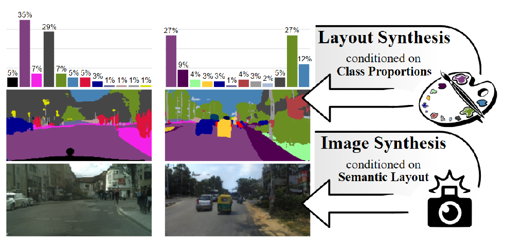
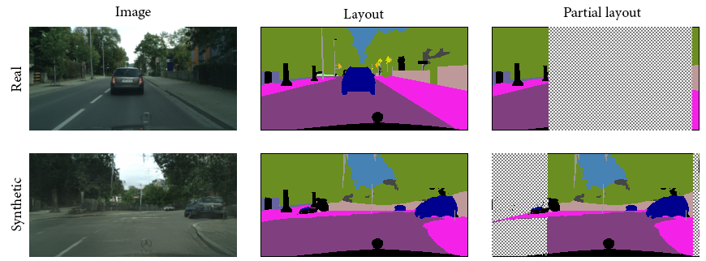
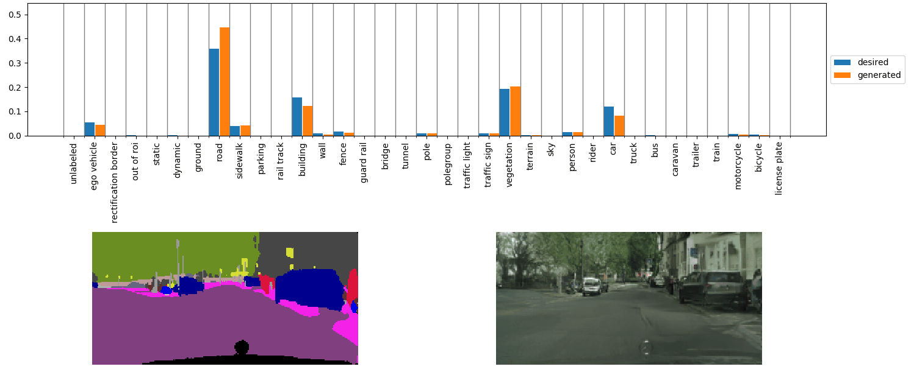
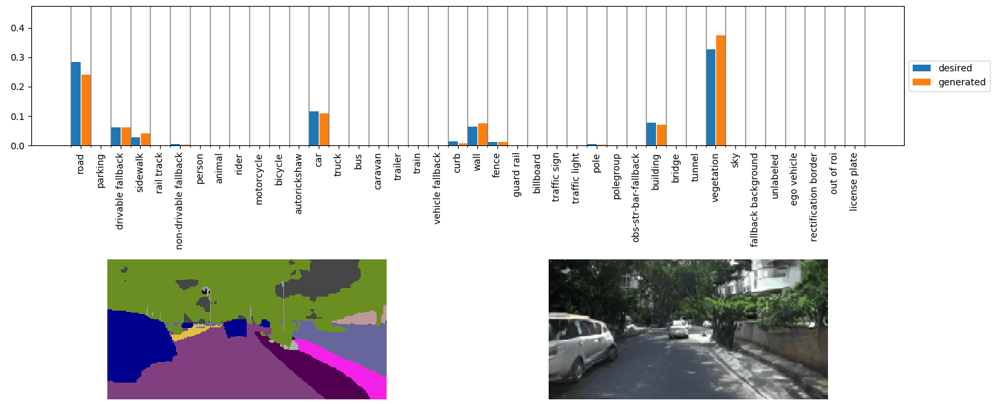
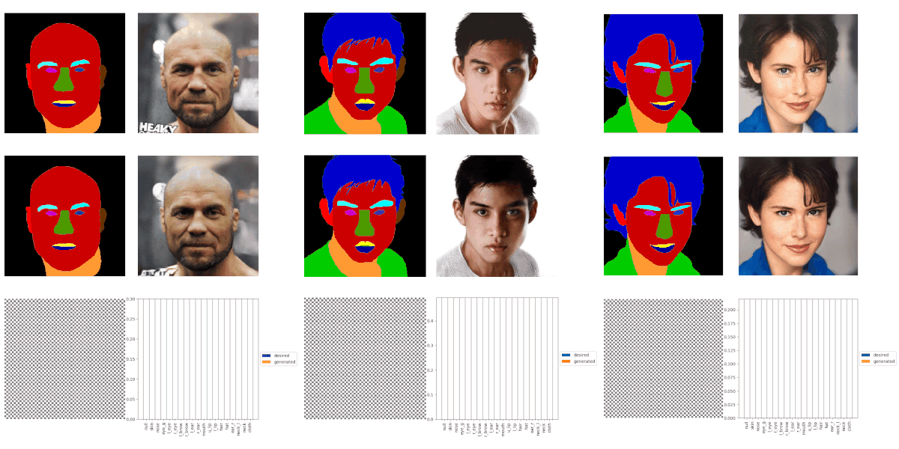

# Semantic Palette - Official PyTorch Implementation

<p align="center"></p>

> **Semantic Palette: Guiding Scene Generation with Class Proportions**<br>
> [Guillaume Le Moing](https://16lemoing.github.io/), [Tuan-Hung Vu](https://tuanhungvu.github.io/), [Himalaya Jain](https://himalayajain.github.io/), [Patrick Pérez](https://ptrckprz.github.io/), [Matthieu Cord](http://webia.lip6.fr/~cord/) <br>
> In CVPR 2021.<br>

> Paper: https://arxiv.org/abs/2106.01629 <br>
> Video: https://youtu.be/ejkbaJD4Emk <br>

> **Abstract:** *Despite the recent progress of generative adversarial networks (GANs) at synthesizing photo-realistic images, producing complex urban scenes remains a challenging problem. Previous works break down scene generation into two consecutive phases: unconditional semantic layout synthesis and image synthesis conditioned on layouts. In this work, we propose to condition layout generation as well for higher semantic control: given a vector of class proportions, we generate layouts with matching composition. To this end, we introduce a conditional framework with novel architecture designs and learning objectives, which effectively accommodates class proportions to guide the scene generation process. The proposed architecture also allows partial layout editing with interesting applications. Thanks to the semantic control, we can produce layouts close to the real distribution, helping enhance the whole scene generation process. On different metrics and urban scene benchmarks, our models outperform existing baselines. Moreover, we demonstrate the merit of our approach for data augmentation: semantic segmenters trained on real layout-image pairs along with additional ones generated by our approach outperform models only trained on real pairs.*

## Installation

Clone this repository:
```
git clone https://github.com/valeoai/SemanticPalette.git
cd SemanticPalette/
```

This code requires PyTorch 1.1+ and python 3+. To install dependencies run:
```
pip install -r requirements.txt
```

To install apex run:
```
cd tools
git clone https://github.com/NVIDIA/apex
cd apex
pip install -v --no-cache-dir --global-option="--cpp_ext" --global-option="--cuda_ext" ./
cd ../..
```

To install inplace_abn run:
```
cd models/segmentor
git clone https://github.com/mapillary/inplace_abn.git
cd inplace_abn
python setup.py install
cd ../../..
```

Download segmenter pretrained weights:
```
cd checkpoints
wget http://sceneparsing.csail.mit.edu/model/pretrained_resnet/resnet101-imagenet.pth
cd ..
```

## Prepare datasets

**Cityscapes**

First, prepare the corresponding directory:
```
mkdir datasets/cityscapes
```
Download the data (_i.e._, images `leftImg8bit_trainvaltest.zip` and corresponding annotations `gtFine_trainvaltest.zip`) from the [official database](https://www.cityscapes-dataset.com/) and put it in this new directory, then run:
```
unzip datasets/cityscapes/leftImg8bit_trainvaltest.zip -d datasets/cityscapes
unzip datasets/cityscapes/gtFine_trainvaltest.zip -d datasets/cityscapes
```

**Cityscapes-25k**

Download the extra images `leftImg8bit_trainextra.zip` into the `datasets/cityscapes` folder, then run:
```
unzip datasets/cityscapes/leftImg8bit_trainextra.zip -d datasets/cityscapes
```

In the same folder, download annotations estimated by [state-of-the-art segmentation model](https://arxiv.org/abs/2005.10821) from [google drive](https://drive.google.com/file/d/1DtPo-WP-hjaOwsbj6ZxTtOo_7R_4TKRG/view?usp=sharing), then run:
```
unzip datasets/cityscapes/refinement_final_v0.zip -d datasets/cityscapes
mkdir datasets/cityscapes/extraFine
mv datasets/cityscapes/refinement_final/train_extra/ datasets/cityscapes/extraFine/
rm -r datasets/cityscapes/extraFine/train_extra/tmp
python data/scripts/prepare_cityscapes_25k.py --data_root datasets/cityscapes/extraFine
```

**Indian Driving Dataset (IDD)**

First, prepare the corresponding directory:
```
mkdir datasets/idd
```
In this folder, download the data from the [official database](https://idd.insaan.iiit.ac.in/) and use the [AutoNUE codebase](https://github.com/AutoNUE/public-code) to preprocess the labels, then run:
```
python data/scripts/prepare_idd.py --data_root datasets/idd
```

**CelebA**

First, prepare the corresponding directory:
```
mkdir datasets/celeba
```
Download the data from [here](https://github.com/switchablenorms/CelebAMask-HQ), then run:
```
python data/scripts/prepare_celeba.py --data_root datasets/celeba
```
## Training

_All scripts are given for Cityscapes dataset. Note that similar scripts can be obtained for Cityscapes-25k (adding `--load_extra` flag), as well as for IDD and CelebA (setting `--dataset` flag to `idd` and `celeba` respectively)._

**1 - Palette distribution estimation**

Load semantic histograms from the training set and fit a Gaussian Mixture Model (GMM) whose number of components is set according to the [Akaike information criterion](https://en.wikipedia.org/wiki/Akaike_information_criterion).
```
bash scripts/train_palette_estimator.sh
``` 

**2 - Layout synthesizer training**

_Before running the following command lines, one should change `--estimator_load_path` in the scripts to point to the checkpoint folder of the trained palette estimator from step 1._

- Palette-conditioned layout synthesis
```
bash scripts/train_layout_synthesizer.sh
``` 

- Palette-conditioned partial editing of layouts
```
bash scripts/train_partial_layout_synthesizer.sh
``` 

The layout synthesizer is trained from low to high resolution and checkpoints are saved for each resolution level. Stop training when you have reached the desired resolution.

**3 - Image synthesizer training**

Then, train the image synthesizer ([GauGAN](https://arxiv.org/abs/1903.07291) in our case):
```
bash scripts/train_image_synthesizer_128.sh
```
One can change `--max_dim` to train at another resolution level.

**4 - End-to-end fine-tuning**

_Once again, one needs to update the paths corresponding to checkpoints from step 1, 2 and 3 in the scripts._

Fine-tune layout and image models end-to-end:
```
bash scripts/train_layout_image_synthesizer_128.sh
bash scripts/train_partial_layout_image_synthesizer_128.sh
```

### Testing

**5 - Segmenter training**

Model testing includes evaluating the performance on a downstream task when using data synthesized by our approach.
We train a segmentation model in different configurations: either on synthetic data, real data or the combination of both, with full or partial editing of layouts.
```
bash scripts/train_segmenter_real_128.sh
bash scripts/train_segmenter_synthetic_128.sh
bash scripts/train_segmenter_real_and_synthetic_128.sh
bash scripts/train_segmenter_real_and_partial_synthetic_128.sh
```

**6 - Performance evaluation**

To compute all evaluation metrics and save them to a csv file, run:
```
bash scripts/test_synthetic_128.sh
```

### Demo

We provide checkpoints for various configurations:
<table>
  <tr>
    <th>Dataset</th>
    <th>Layout synthesis</th>
    <th>Image synthesis</th>
    <th>Resolution</th>
    <th>End-to-end</th>
    <th>Download</th>
  </tr>
  <tr>
    <td>Cityscapes</td>
    <td align="center">Partial</td>
    <td align="center">GauGAN</td>
    <td align="center">128x256</td>
    <td align="center">&cross;</td>
    <td align="center"><a href="https://drive.google.com/file/d/16g3X-tl7EECO8SruZn-D7GyWr-UBxDiq/view?usp=sharing">checkpoint</a></td>
  </tr>
  <tr>
    <td>Cityscapes</td>
    <td align="center">Full</td>
    <td align="center">GauGAN</td>
    <td align="center">128x256</td>
    <td align="center">&cross;</td>
    <td align="center"><a href="https://drive.google.com/file/d/1XwuMsTIEKO0P5cEz1gptm6vkq6o0xs9P/view?usp=sharing">checkpoint</a></td>
  </tr>
  <tr>
    <td>Cityscapes-25k</td>
    <td align="center">Full</td>
    <td align="center">GauGAN</td>
    <td align="center">128x256</td>
    <td align="center">&check;</td>
    <td align="center"><a href="https://drive.google.com/file/d/12wB8OLDJfZgY_LcaxQxB_XfbRJxI3T_J/view?usp=sharing">checkpoint</a></td>
  </tr>
  <tr>
    <td>IDD</td>
    <td align="center">Full</td>
    <td align="center">GauGAN</td>
    <td align="center">128x256</td>
    <td align="center">&check;</td>
    <td align="center"><a href="https://drive.google.com/file/d/1Y8ayPRYWRCT0yjDoz7Inf_Ex0Zp8dJXL/view?usp=sharing">checkpoint</a></td>
  </tr>
  <tr>
    <td>CelebA</td>
    <td align="center">Partial</td>
    <td align="center">SEAN</td>
    <td align="center">256x256</td>
    <td align="center">&cross;</td>
    <td align="center"><a href="https://drive.google.com/file/d/1WgtEHHbAuJIB1nCwgqXm90r_GswSdwrD/view?usp=sharing">checkpoint</a></td>
  </tr>
</table>

Extract checkpoints with the following command (by replacing `CKPT.zip` with the corresponding name) before running the demo.
```
unzip CKPT.zip -d checkpoints/
```

**7 - Partial editing on Cityscapes**

<p align="center"></p>

```
bash scripts/demo_partial_editing_128.sh
```

**8 - Palette interpolation on Cityscapes-25k**

<p align="left"></p>

```
bash scripts/demo_palette_interpolation_128.sh
```

**9 - Latent interpolation on IDD**

<p align="left"></p>

```
bash scripts/demo_latent_interpolation_128.sh
```

**10 - Face editing on CelebA**

<p align="left"></p>

To automatically edit semantic attribute of faces while keeping their appearance we replace GauGAN by SEAN in our framework (by setting the flag `--i_img_type` to `"style_generator"`).
We use a pretrained image model which can be downloaded from [here](https://github.com/ZPdesu/SEAN).

By doing so, appearance can be propagated from a source image to the edited image. For new semantic content (which do not appear in the source image) we use a random style vector taken from the training dataset. Hence, we precompute style vectors by running:
```
bash scripts/extract_style.sh
```

Then, after updating the logs folder corresponding to style extraction, the following command performs face editing in different scenarios:
```
bash scripts/demo_face_editing_256.sh
```

### Citation

If you find this code useful in your research, please consider citing:

    @inproceedings{lemoing2021semanticpalette,
      title     = {Semantic Palette: Guiding Scene Generation with Class Proportions},
      author    = {Le Moing, Guillaume and Vu, Tuan-Hung and Jain, Himalaya and P{\'e}rez, Patrick and Cord, Mathieu},
      booktitle = {CVPR},
      year      = {2021}
    }

### Acknowledgments
This code borrows from [GauGAN](https://github.com/nvlabs/spade/), [SBGAN](https://github.com/azadis/SB-GAN), [SEAN](https://github.com/ZPdesu/SEAN) and [pytorch segmentation toolbox](https://github.com/speedinghzl/pytorch-segmentation-toolbox).

### License
Semantic Palette is released under the [Apache 2.0 license](./LICENSE).
